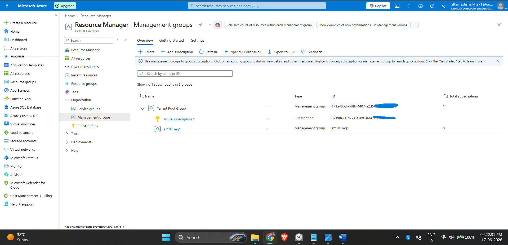
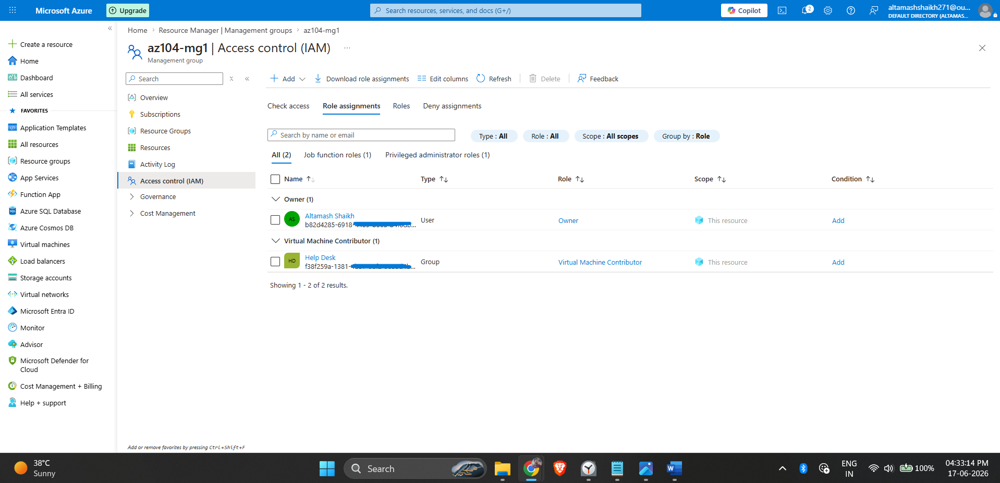
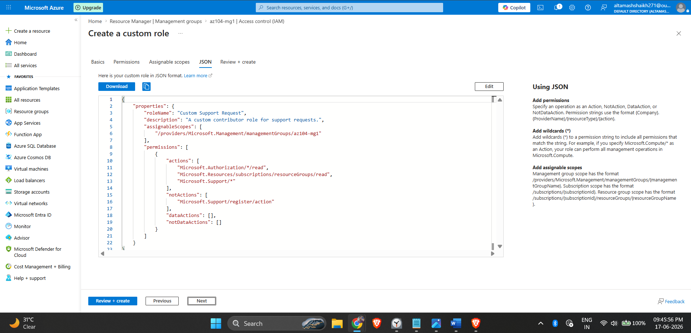

# Azure Governance: Management Groups & RBAC (AZ-104 Lab)

## Objective
The objective of this deployment was to simplify the management of Azure resources by establishing a logical governance hierarchy using **Management Groups** and enforcing the Principle of Least Privilege through **Role-Based Access Control (RBAC)**.

## Skills Demonstrated
- **Azure Governance:** Designed a Management Group hierarchy to logically organize and segment subscriptions for centralized policy and access management.
- **Role-Based Access Control (RBAC):** Assigned built-in Azure roles (Virtual Machine Contributor) to Entra ID Security Groups at the Management Group scope.
- **Custom Role Creation:** Cloned and modified a built-in JSON role definition to create a custom RBAC role with specific `NotActions` to restrict resource provider registration.

## Step-by-Step Configuration

### 1. Implementing Management Groups
To allow for RBAC and Azure Policy to be inherited across multiple subscriptions, I created a new Management Group (`az104-mg1`). In a production environment, this allows centralized IT or Help Desk teams to be granted access across all localized subscriptions without needing individual subscription-level assignments.

*Management Group deployed under the Tenant Root Group.*

### 2. Assigning Built-in RBAC Roles
I navigated to the Access Control (IAM) blade of the Management Group and assigned the built-in **Virtual Machine Contributor** role to the "Help Desk" security group. Applying this at the Management Group level ensures the Help Desk team inherits these permissions for any subscription placed inside this group.

*Role assignment verifying the Help Desk group has VM Contributor access.*

### 3. Engineering a Custom RBAC Role
The built-in "Support Request Contributor" role possessed too many privileges for the specific lab scenario. To adhere to strict security baselines, I cloned the built-in role and authored a **Custom RBAC Role** named "Custom Support Request". I explicitly added `Microsoft.Support/register/action` to the `NotActions` array to prevent Help Desk users from registering new resource providers.

*Custom JSON role definition displaying the explicitly excluded actions.*

## Key Takeaways
- **Scope Matters:** Assigning roles at the Management Group level significantly reduces administrative overhead compared to assigning them per subscription or per resource.
- **Group-Based Access:** As a best practice, roles were assigned to Entra ID Groups rather than individual users to ensure scalable access lifecycle management.
- **Least Privilege:** When built-in roles offer excessive permissions, custom roles (defined via JSON) must be engineered to securely restrict operational capabilities.